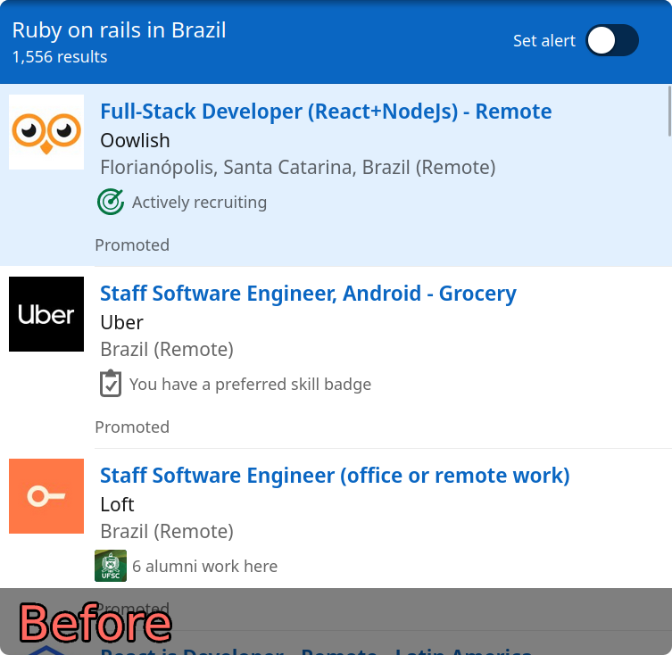
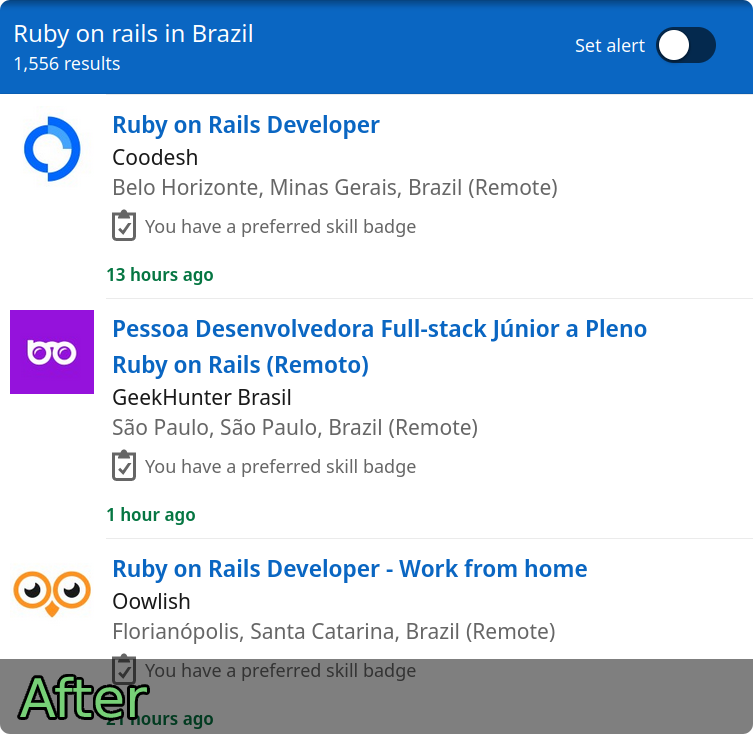
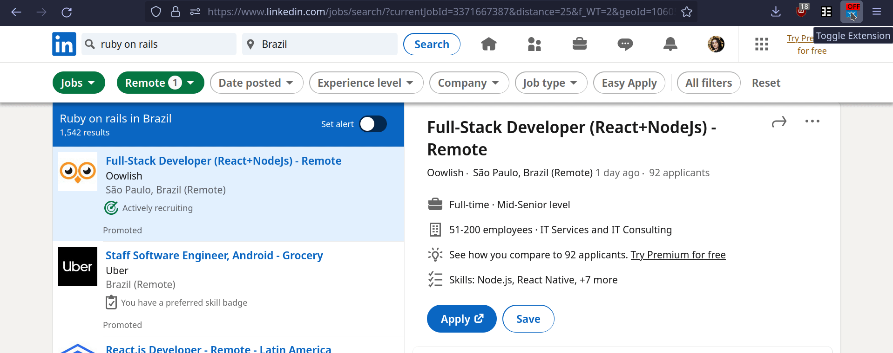

# Hide Promoted Jobs

Automatically hides promoted job postings on LinkedIn's job search pages.

   

## Installation

### Chrome

### Firefox

## Usage

You can click on the extension to toggle it off/on. When enabled, the extension will automatically hide promoted job postings. 

  

## License

This software is distributed under the MIT License in the hope that it will be useful, but WITHOUT ANY WARRANTY. See `LICENSE` for more information.

## Contact

Fabricio Duarte Júnior - fabricio.duarte.jr@gmail.com

## Acknowledgements

This extension was based on u/mothibault's script available [here](https://www.reddit.com/r/linkedin/comments/nhzcyz/comment/hrdq2fk).
